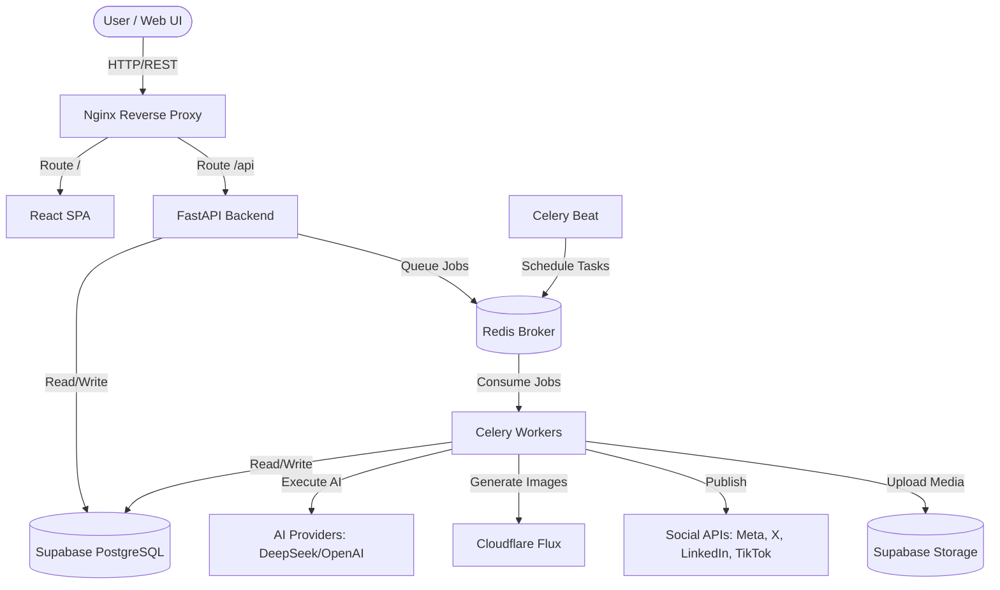

# Winsta Studio — Social Media Trend & Automation Pipeline

Welcome to the **Winsta Studio** repository. This project is a comprehensive, AI-driven automation platform designed to discover emerging trends, analyze and score them, generate relevant social media content, and automatically publish across multiple platforms with human-in-the-loop approval workflows.

## 🚀 Project Overview

Winsta Studio acts as an end-to-end Social Media Agent pipeline. Instead of relying on manual research, the system automates the following:
- **Trend Discovery:** Periodically scans configured sources (e.g., social platforms, news, custom APIs) for emerging topics.
- **AI Scoring & Filtering:** Evaluates trends against customizable criteria (brand fit, virality potential) using AI models (DeepSeek, OpenAI).
- **Content Generation:** Automatically generates text prompts, image assets (via Cloudflare Flux), and full campaigns based on high-scoring trends.
- **Approval Workflow:** Stages generated content for human review before any destructive actions or public publishing occur.
- **Multi-Platform Publishing:** Distributes approved content directly to connected accounts (Instagram, LinkedIn, X, TikTok, YouTube).

---

## 🏗️ Architecture & Tech Stack

The system is built as a **Modular Monolith** orchestrated via Docker Compose.

### Tech Stack
- **Frontend:** React 19, Vite, TailwindCSS 4, React Router (TypeScript).
- **Backend Core:** FastAPI (Python), SQLAlchemy (asyncpg), Pydantic, Alembic.
- **Background Jobs:** Celery & Celery Beat (for scheduled trend collection and publishing).
- **Caching & Message Broker:** Redis.
- **Database & Storage:** Supabase (PostgreSQL for relational data, Supabase Storage for media assets).
- **Reverse Proxy:** Nginx (Routing frontend and API traffic).

### High-Level Architecture Diagram


---

## 🔄 Core Workflow & Pipeline

The automation pipeline consists of several interconnected modules handled asynchronously by Celery workers.

### 1. Trend Collection (`trend.collect`)
- **Celery Beat** triggers scheduled jobs based on user-defined frequencies.
- Workers fetch raw data from configured **Trend Sources**.
- Raw data is stored as `TrendRuns` and raw `TrendCandidates`.

### 2. Processing & AI Scoring (`trend.process`, `trend.ai`)
- Raw candidates are normalized and deduplicated.
- The AI engine (e.g., DeepSeek) evaluates candidates against configured **Scoring Criteria**.
- Only trends that pass the `SCORING_THRESHOLD` (e.g., > 70.0) are promoted to active **Trends**.

### 3. Content Generation (`social.generate`)
- The system uses the active Trends to generate structured **Social Media Campaigns**.
- Text generation creates captions, threads, and scripts.
- Image generation requests are dispatched to **Cloudflare Flux** to create accompanying visuals.
- Generated media is uploaded to **Supabase Storage**.

### 4. Human Approval Gate
- **Crucial Step:** AI is not trusted to publish blindly.
- Generated campaigns enter a `Pending` state.
- Users review the campaigns, edit copy/images, and click **Approve** in the React Dashboard.

### 5. Publishing & Analytics (`social.publish`, `social.analytics`)
- Approved campaigns are queued for immediate publishing or scheduled via the **Social Calendar**.
- Workers utilize OAuth tokens to interact with external APIs (Instagram, X, LinkedIn, etc.) to publish the content.
- Post-publish, analytics workers periodically fetch engagement metrics (likes, shares, views) to report back to the dashboard.

---

## 🚦 Request Lifecycle & Internal Proxy

To help developers understand exactly how data moves through the system, here is the lifecycle of a typical request, detailing the internal proxy and backend execution.

### 1. The Nginx Internal Proxy (Entrypoint)
All incoming HTTP and WebSocket traffic first hits the **Nginx Proxy** (defined in `nginx/conf.d/default.conf`).
- **Rate Limiting & Security:** Nginx applies rate limits (e.g., 20 req/s burst for APIs) and blocks suspicious user-agents/methods before they ever reach the backend.
- **Routing Rules:**
  - `GET/POST /api/*` ➔ Proxied directly to the **FastAPI (`api`)** service on port 8000. Nginx explicitly preserves the `Authorization` header and applies CORS headers.
  - `GET /health` ➔ Proxied to the backend health check for Docker healthchecks.
  - `/*` (everything else) ➔ Proxied to the **React SPA (`frontend`)**. Nginx intercepts 404 errors and rewrites them to `/index.html` to support client-side routing.
- **WebSockets:** Nginx handles HTTP 1.1 `Connection: Upgrade` headers, allowing WebSockets to pass through seamlessly (essential for Vite HMR and real-time backend updates).
- **Caching:** Nginx is pre-configured with caching zones (`media_cache`, `api_cache`, `static_cache`) in `nginx.conf`, which can be enabled for specific read-heavy endpoints.

### 2. FastAPI Request Processing
When a request reaches the `/api/` path:
1. **Middleware:** The request passes through CORS middleware, logging (via `structlog`), and authentication guards.
2. **Controllers (Routers):** The request is routed to a domain-specific controller (e.g., `app.modules.trends.controllers`).
3. **Services (Business Logic):** The controller delegates to a Service class, which handles data validation (via Pydantic) and interacts with the PostgreSQL database asynchronously using SQLAlchemy (`asyncpg`).
4. **Immediate Response vs. Async Offloading:** 
   - If the request is a simple CRUD operation, the Service returns data immediately.
   - If the request involves heavy computation (e.g., "Analyze this trend" or "Generate an image"), the Service enqueues a Celery Task into **Redis** and immediately returns a `202 Accepted` or a status indicating the job is pending.

### 3. Celery Worker Execution (Background Tasks)
1. The **Celery Worker** continuously listens to specific Redis queues (`trend.process`, `social.publish`, etc.).
2. When a job is received, the worker executes the heavy task synchronously or pseudo-asynchronously. 
3. **External API Calls:** The worker communicates with AI Providers (DeepSeek/OpenAI), Cloudflare (Flux image gen), or Social Media APIs.
4. **State Update:** Once the task finishes, the worker updates the corresponding record in the PostgreSQL database (e.g., changing a campaign status from `generating` to `pending_approval`).
5. **Client Notification:** The frontend, which is polling or listening for state changes, sees the updated database record on its next request.

---

## 📂 Project Structure

```
.
├── backend/                  # FastAPI Application
│   ├── app/
│   │   ├── core/             # Settings, DB connection, Redis, Middleware
│   │   ├── modules/          # Domain Logic (Modular Monolith)
│   │   │   ├── ai/           # LLM and Image Gen Integrations
│   │   │   ├── approvals/    # Human-in-the-loop workflows
│   │   │   ├── auth/         # JWT Authentication
│   │   │   ├── prompt_generation/ 
│   │   │   ├── scoring/      # AI Evaluation logic
│   │   │   ├── social_media/ # OAuth & Publishing Adapters
│   │   │   └── trends/       # Trend discovery & processing
│   │   └── workers/          # Celery App and Tasks
│   ├── alembic/              # Database Migrations
│   ├── tests/                # Pytest unit & integration tests
│   └── requirements.txt      # Python dependencies
│
├── frontend/                 # React SPA
│   ├── src/
│   │   ├── api/              # Axios API clients
│   │   ├── components/       # Reusable UI (Tailwind)
│   │   ├── pages/            # View components (Admin, Dashboard, Social, Trends)
│   │   └── services/         # State & Business logic abstraction
│   ├── package.json          # Node dependencies
│   └── vite.config.ts        # Vite build config
│
├── nginx/                    # Reverse Proxy Configuration
│   ├── conf.d/               # Route definitions for API and Frontend
│   └── nginx.conf            
│
├── docker-compose.yml        # Multi-container orchestration
├── example.env               # Environment variable template
└── reload.sh                 # Utility for hot-reloading Docker services
```

---

## 🛠️ Local Development Setup

### 1. Environment Configuration
Copy the template to create your local environment file:
```bash
cp example.env .env
```
Ensure you fill out the necessary API keys in `.env`, specifically:
- `SUPABASE_URL` and `SUPABASE_SERVICE_ROLE_KEY` (Database)
- `DEEPSEEK_API_KEY` (AI Provider)
- `CLOUDFLARE_ACCOUNT_ID` & `CLOUDFLARE_API_TOKEN` (Image Gen)
- Social Media OAuth Credentials (if testing publishing)

### 2. Run with Docker Compose
The easiest way to spin up the entire stack (API, Frontend, Celery Worker, Beat, Redis, Nginx) is via Docker:
```bash
docker-compose up --build
```

### 3. Access the Application
- **Frontend Dashboard:** `http://localhost:3005`
- **FastAPI Swagger Docs:** `http://localhost:8000/docs`

### 4. Database Migrations
To apply database migrations to your Supabase instance, run Alembic from inside the API container:
```bash
docker exec -it winsta-smt-api alembic upgrade head
```

---

## 🔒 Security & Privacy

- **OAuth Tokens:** The system requires OAuth tokens to publish on your behalf. These are stored securely in the database.
- **Human-in-the-loop:** The AI operates strictly as a planner and drafter. Destructive actions (like publishing a post) require manual approval via the dashboard.
- **Environment Variables:** Never commit `.env` to version control. Production secrets should be injected securely via your hosting provider's secret manager.
